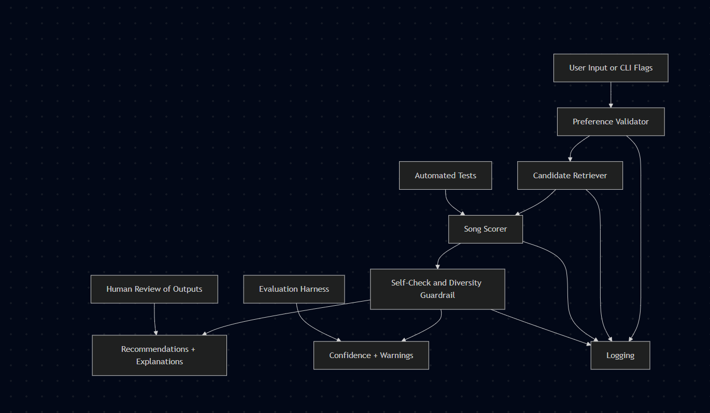

# Music Recommender Workflow

## Title and Summary

This project is an explainable music recommender that matches a user taste profile to songs in a local catalog. It recommends tracks using genre, mood, and numeric audio-style features such as energy, tempo, valence, danceability, and acousticness, then explains why each result was chosen.

The original project from Modules 1-3 was **Music Recommender Simulation**. Its original goal was to show how a small content-based recommender could turn a user profile and song metadata into ranked suggestions. In this extended version, I kept that scoring foundation and added an integrated retrieval step, an observable recommendation workflow, confidence scoring, logging, and an evaluation harness so the system behaves more like a complete AI application rather than a single scoring function.

## Why It Matters

Recommendation systems are one of the most common real-world AI applications. Even in a small classroom-scale project, they show the same trade-offs seen in production systems: retrieval vs. ranking, explainability vs. complexity, and personalization vs. bias.

## Main AI Features

- **Agentic workflow**: the system now performs a visible multi-step process: validate inputs, retrieve likely candidates, rank them, and run a self-check before final output.
- **Retrieval-enhanced recommendation**: instead of scoring the entire catalog blindly, the system first retrieves the most promising songs based on the active preference signals.
- **Reliability system**: the app logs its behavior, reports confidence, warns when results are weak or unstable, and includes repeatable tests and an evaluation script.

## Architecture Overview

The recommender is organized into a small but complete pipeline:

1. The CLI accepts user preferences or falls back to a default profile.
2. The validator checks ranges and normalizes inputs.
3. A candidate retriever pulls the most promising songs from the catalog.
4. The scorer ranks those candidates with the existing content-based matching logic.
5. A self-check applies a small diversity guardrail when repeated artists dominate the top results.
6. The system returns recommendations, confidence, warnings, and a workflow trace.
7. Logs and evaluation scripts make the behavior inspectable.

### System Diagram



The diagram shows how data flows through the system: user input is validated, candidates are retrieved from the catalog, scored against the user profile, checked for diversity, and returned with confidence and warnings. Automated tests validate the scoring logic, and the evaluation harness measures reliability across scenarios.

## Repository Structure

```text
data/
  songs.csv              Small local song catalog
src/
  main.py                CLI entry point
  recommender.py         Retrieval, scoring, workflow, logging
  evaluate.py            Reliability / evaluation harness
tests/
  test_recommender.py    Directly runnable automated tests
model_card.md            Model card and reflection
```

## Setup Instructions

1. Create and activate a virtual environment if you want isolation.

```bash
python -m venv .venv
```

Windows:

```bash
.venv\Scripts\activate
```

macOS or Linux:

```bash
source .venv/bin/activate
```

2. Install dependencies.

```bash
pip install -r requirements.txt
```

3. Run the main recommender.

```bash
python -m src.main
```

4. Run with a custom profile.

```bash
python -m src.main --genre lofi --mood chill --energy 0.4 -k 3 --show-workflow
```

5. Run the automated tests.

```bash
python tests/test_recommender.py
```

6. Run the evaluation harness.

```bash
python -m src.evaluate
```

## Sample Interactions

### 1. Chill Lofi Listener

Input:

```bash
python -m src.main --genre lofi --mood chill --energy 0.4 -k 3 --show-workflow
```

Observed output:

```text
1. Midnight Coding   | score 1.00
2. Library Rain      | score 0.98
3. Focus Flow        | score 0.75
Confidence: 0.81
Warning: Top songs are very close in score, so ranking may be unstable.
```

### 2. High-Energy Workout Listener

Input:

```bash
python -m src.main --genre pop --mood intense --energy 0.9 -k 3
```

Observed output:

```text
1. Gym Hero          | score 0.99
2. Sunrise City      | score 0.70
3. Storm Runner      | score 0.50
Confidence: 1.00
```

### 3. Acoustic Reflective Listener

Input:

```bash
python -m src.main --genre folk --mood contemplative --energy 0.33 --tempo 76 -k 3 --show-workflow
```

Observed output:

```text
1. Autumn Walk       | score 1.00
2. Library Rain      | score 0.39
3. Focus Flow        | score 0.36
Confidence: 1.00
```

## Design Decisions

- I preserved the original content-based scoring logic instead of replacing it, because the earlier coursework already established a working baseline.
- I added retrieval before scoring so the system now has a visible search-and-rank pipeline rather than a single opaque step.
- I kept the scoring explainable with human-readable reasons instead of switching to a black-box model, which made testing and reflection easier.
- I added confidence and warnings because recommendation quality can look plausible even when the score margins are weak.
- I used a small artist-diversity guardrail as a safe post-processing step instead of aggressively rewriting the ranking logic.

## Reliability and Evaluation

This project includes three reliability mechanisms:

- **Automated tests**: `tests/test_recommender.py` checks sorting, explanations, validation, confidence traces, and acoustic preference behavior.
- **Evaluation harness**: `src/evaluate.py` runs fixed scenarios and prints a summary.
- **Logging and guardrails**: each recommendation run writes workflow information to `logs/recommender.log`, and the CLI surfaces warnings when match quality is low or unstable.

### Current Testing Summary

- 5 out of 5 direct automated tests passed.
- 4 out of 4 evaluation scenarios passed.
- Average confidence across the evaluation harness was **0.78**.
- The weakest scenario was the broad "energy-only" profile, which is expected because sparse user context makes ranking less certain.

## What Worked, What Did Not, and What I Learned

What worked well:

- Exact genre and mood matches still create intuitive top recommendations.
- The retrieval step keeps the system focused and makes the workflow easier to inspect.
- Confidence warnings are useful for flagging cases that look plausible but are not strongly separated.

What did not work as well:

- Sparse profiles, such as only specifying energy, still produce lower-confidence outputs.
- The small catalog limits variety and makes some rankings fragile when multiple songs are near-ties.

What I learned:

- Even simple AI systems benefit from explicit workflow stages.
- Retrieval, ranking, and evaluation are easier to reason about when separated.
- Reliability features are not extras; they change how trustworthy the application feels.

## Reflection and Ethics

### Limitations and Biases

- The catalog is tiny and hand-curated, so the system reflects the biases of the dataset more than real-world music diversity.
- Genre labels are treated literally, which can over-reward exact tag matches and under-reward cross-genre similarity.
- The system only uses structured metadata; it does not understand lyrics, culture, or personal context.

### Possible Misuse and Prevention

- A recommender like this could be misused to overfit users into narrow taste bubbles.
- To reduce that risk, I added diversity repair, confidence warnings, and transparent explanations rather than presenting the rankings as absolute truth.
- This project should be treated as an educational prototype, not an authority on music taste.

### Reliability Surprise

The most surprising result was how quickly confidence drops when the user profile becomes vague. A system can still output ranked songs, but the ranking becomes much less trustworthy when only one weak signal is available.

### Collaboration With AI

AI was helpful when brainstorming how to extend the original recommender without discarding working code. One especially helpful suggestion was to separate the system into retrieval, ranking, and self-check stages, which made the architecture cleaner and easier to document.

AI was less helpful when it leaned on environment assumptions that were not true in this workspace, especially around test execution tools. That suggestion was flawed because the available Python interpreter did not include the expected tooling, so I adjusted the project to use a directly runnable test file instead.

## Future Improvements

- Expand the catalog with more songs and richer metadata.
- Add multi-label moods or soft similarity between genres.
- Compare this explainable baseline against an embedding-based recommender.
- Track user feedback over time so the system can adapt instead of relying only on static preferences.

## Demo Walkthrough

Watch a complete end-to-end demo of the system in action:

**[Loom Video Walkthrough](https://www.loom.com/share/2c63cc4fb32540149a814972895d4e12)** 
**[Loom Video Walkthrough-continue](https://www.loom.com/share/dd1f03210c534eb6830ec9154e61fb4b)** 

The video demonstrates:
1. Default recommendation with confidence scoring
2. Custom lofi + chill profile with workflow trace showing retrieval, ranking, and self-check steps
3. Evaluation harness results showing pass/fail outcomes and confidence averages

For a detailed walkthrough of all demo scenarios with expected outputs, see [DEMO.md](DEMO.md).

## Portfolio Reflection

This project demonstrates my ability to build a complete, transparent AI system from design through evaluation. Rather than just implementing a scoring algorithm, I chose to wrap it in a multi-step agentic workflow with retrieval optimization, confidence estimation, automated testing, and logging. This reflects my understanding that trustworthy AI requires more than accuracy—it requires inspectability, guardrails, and honest uncertainty communication.

A key insight I learned is that reliability features are not optional extras; confidence scoring, diversity repair, and warning messages fundamentally change how trustworthy an application feels. The workflow trace feature turned out to be especially valuable, making the recommendation decisions transparent enough to debug and audit.

Future work would integrate user feedback signals, compare this rule-based approach against embedding-driven methods, or expand the catalog to production scale. The architecture I built is modular enough to support those extensions without major rewrites.

## Related Documentation

- [Model Card](model_card.md)

